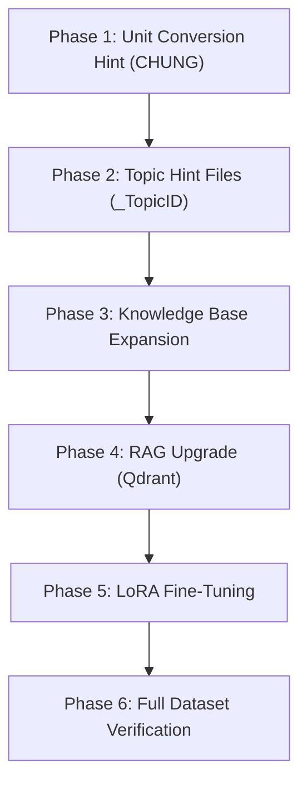

# Plan Nâng Cấp Pipeline Vật Lý (Revised)

## Hiện Trạng

| Item | Status |
|------|--------|
| **Dataset** | 1352 câu (LD:397, CH:290, NL:190, TD:177, DDT:130, THCB:80, DT:68, CHLT:20) |
| **Router** | `topic_router.py` phân loại bằng **keyword** (không dùng mã ID) → **giữ nguyên** |
| **RAG** | BM25 in-memory trên `physics_knowledge_base.json` (~80 entries). **Chưa dùng Qdrant, chưa có dense embedding, chưa reranking** |
| **Model** | Qwen2.5:7B qua Ollama (localhost:11434) |
| **Accuracy** | ~40% trên 80 câu đầu (10 câu/topic × 8 topics) |

### Tóm tắt lỗi chính theo topic

| Topic | Acc | Lỗi chính (tổng quát cho toàn bộ topic) |
|-------|-----|----------------------------------------|
| CH | 100% | OK |
| CHLT | 0% | Không xử lý được câu Yes/No, RAG trả sai công thức |
| DDT | 40% | Câu hỏi định tính (tỷ lệ, mô tả), model bịa số |
| DT | 10% | Vector addition sai, symbolic answer, thiếu geometry |
| LD | 40% | Hướng lực sai, geometry sai, equilateral/perpendicular bisector |
| NL | 50% | **Đơn vị output** (tính đúng J nhưng đề yêu cầu mJ/nJ) |
| TD | 40% | Connected/Disconnected logic sai, đơn vị output |
| THCB | 40% | LCNS vs LCNS/2, max vs mean deviation, % conversion |

---

## Kiến Trúc Đề Xuất

```
Pipeline Flow (sau nâng cấp):

Question
  │
  ├─ Step 0: topic_router (keyword) + query_router (quant/qual)
  │
  ├─ Step 1: RAG (Qdrant hybrid search + BM25 reranking)  ← Phase 4
  │
  ├─ Step 2: Hint Engine                                   ← Phase 1+2
  │   ├─ unit_conversion_hint.py (CHUNG cho tất cả topic)
  │   ├─ hint_coulomb_force_LD.py
  │   ├─ hint_electric_field_DT.py
  │   ├─ hint_capacitor_TD.py
  │   ├─ hint_ac_resonance_CHLT.py
  │   ├─ hint_magnetism_DDT.py
  │   ├─ hint_measurement_error_THCB.py
  │   ├─ hint_energy_oscillation_NL.py
  │   └─ hint_ac_circuit_CH.py
  │
  ├─ Step 3: Reasoner LLM (Qwen 7B) → FOL + Python code
  ├─ Step 4: Sandbox → execute code
  ├─ Step 5: Normalizer
  └─ Step 6: Structurer → JSON
```

---

## Phase 1: Unit Conversion Hint (CHUNG — không thuộc topic nào)

> [!IMPORTANT]
> Đây là hint **dùng chung** cho tất cả 1352 câu. Xử lý mJ, nJ, kJ, μF, pF, kV/m, cm, mm, v.v.

### [NEW] `app/hints/unit_conversion_hint.py`

**Chức năng:** Phân tích câu hỏi → detect đơn vị đầu vào & đơn vị output mong muốn → inject hint vào prompt.

```python
# Ví dụ output hint:
# "INPUT UNITS: C=100μF→1e-4F, U=30V. OUTPUT: đề yêu cầu đáp án theo μJ → nhân kết quả J × 1e6"
```

**Logic:**
1. Regex detect tất cả đơn vị trong câu hỏi (μF, pF, nF, cm, mm, mC, nC, kHz, mH, kV/m, nJ, mJ, kJ...)
2. Tạo bảng conversion hint: `"100 μF = 100 × 10⁻⁶ F = 1 × 10⁻⁴ F"`
3. Detect đơn vị output (nếu đề hỏi "tính năng lượng (mJ)" hoặc gold unit trong dataset)
4. Inject vào reasoner prompt **trước** topic hint

### [MODIFY] `app/pipeline.py`
- Gọi `unit_conversion_hint(question)` → thêm vào `ctx.unit_hints`
- Truyền `unit_hints` vào `reason()` cùng với `geometry_hints`

### [MODIFY] `app/prompts/reasoner_prompt.py`
- Thêm section `Unit conversion facts:` vào prompt template

---

## Phase 2: Topic-Specific Hint Files

> [!IMPORTANT]
> Mỗi file hint phải xử lý **TẤT CẢ các dạng bài** trong topic, không chỉ 10 câu đầu.

### Cấu trúc folder

```
app/hints/
├── __init__.py                      # Registry: topic → hint function
├── unit_conversion_hint.py          # Phase 1 (CHUNG)
├── hint_coulomb_force_LD.py         # LD: 397 câu
├── hint_electric_field_DT.py        # DT: 68 câu  
├── hint_capacitor_TD.py             # TD: 177 câu
├── hint_ac_resonance_CHLT.py        # CHLT: 20 câu
├── hint_magnetism_DDT.py            # DDT: 130 câu
├── hint_measurement_error_THCB.py   # THCB: 80 câu
├── hint_energy_oscillation_NL.py    # NL: 190 câu
└── hint_ac_circuit_CH.py            # CH: 290 câu (hiện đã OK)
```

### Chi tiết từng file hint

#### [NEW] `hint_coulomb_force_LD.py` (migrate từ `geometry_analyzer.py`)

Xử lý tổng quát cho 397 câu LD:
- **Geometry detection:** right-triangle, equilateral, collinear, isosceles, perpendicular bisector, square, general triangle
- **Force direction:** same-sign repel, opposite-sign attract → vector direction
- **Vector composition:** collinear (add/subtract), perpendicular (Pythagoras), angle θ (law of cosines), equilateral (F_net = √3·F hoặc F_net = F)
- **E-field problems (LD051-LD100):** scalar E = kq/r², vector superposition, midpoint/perpendicular bisector symmetry
- **Special cases:** q0 at center of equilateral/square → F=0, zero-field point location

#### [NEW] `hint_electric_field_DT.py`

Xử lý 68 câu DT:
- **Scalar potential:** V = kq/r, superposition V_total = ΣVi (cộng đại số, KHÔNG phải vector)
- **Geometry cho DT:** perpendicular bisector, equilateral, right-triangle → tính khoảng cách r
- **Symbolic answer detection:** nếu đề cho biến (a, q, k) → hint "trả lời dạng biểu thức"
- **Work by electric force:** W = q(VA - VB)

#### [NEW] `hint_capacitor_TD.py`

Xử lý 177 câu TD:
- **Connected vs Disconnected rules:**
  - Detect keyword: "disconnected/ngắt/rời/tách" → Q = const
  - Detect keyword: "connected/vẫn nối/còn nối" → U = const
- **Parameter change rules:** d↑ → C↓; ε↑ → C↑; A↑ → C↑
- **Series/Parallel:** detect "nối tiếp/series" vs "song song/parallel"
- **Merging capacitors:** like-sign vs unlike-sign plates

#### [NEW] `hint_ac_resonance_CHLT.py`

Xử lý 20 câu CHLT:
- **Yes/No detection:** "Is it resonance?" → compute f0, compare with tolerance
- **Output format hint:** "Answer 'Yes' or 'No', not True/False"
- **Resonance properties:** Z_min=R, I_max=U/R, P_max=U²/R

#### [NEW] `hint_magnetism_DDT.py`

Xử lý 130 câu DDT:
- **Qualitative detection:** "proportional to?", "how does it change?", "what are the characteristics?"
- **Qualitative answer templates:** trả lời bằng text mô tả
- **Quantitative:** B = μ₀nI, L = μ₀N²A/l, Φ = BA·cos(θ)
- **mu_0 precision:** hint dùng 4π×10⁻⁷ exact

#### [NEW] `hint_measurement_error_THCB.py`

Xử lý 80 câu THCB:
- **LCNS rule (VN standard):** sai số dụng cụ = LCNS (full least count)
- **Random error:** max deviation = max(|xi - x̄|)
- **Error propagation:** R=U/I → δR = δU + δI (relative errors ADD)
- **% conversion:** δ% = (Δ/X) × 100

#### [NEW] `hint_energy_oscillation_NL.py`

Xử lý 190 câu NL:
- **Energy conservation:** W_total = W_C + W_L = const
- **Equal energy split:** W_C = W_L ⇒ U = U_max/√2
- **Phase relationships:** q, i, u timing in LC oscillation

#### [NEW] `hint_ac_circuit_CH.py`

CH đã 100% accuracy → file hint minimal, chỉ reinforcement.

### [MODIFY] `app/hints/__init__.py` — Hint Registry

```python
def get_hints(question: str, topic: str) -> list[str]:
    """Dispatch to topic-specific hint generator."""
    # Gọi hint function tương ứng với topic
```

### [MODIFY] `app/pipeline.py`
- Import hint registry
- Gọi `get_hints(question, topic)` → merge với `geometry_hints` → truyền vào reasoner

### [DELETE hoặc DEPRECATE] `app/modules/geometry_analyzer.py`
- Logic chuyển vào `hint_coulomb_force_LD.py`

---

## Phase 3: Knowledge Base Expansion

### [MODIFY] `dataset_2/physics_knowledge_base.json`

Bổ sung công thức thiếu:

| Topic | Bổ sung |
|-------|---------|
| THCB | `random_error = max(\|xi - x̄\|)`, `Delta_instrument = LCNS` (VN standard) |
| TD | Rule text rõ ràng hơn cho connected/disconnected, merging capacitors |
| DT | Vector E-field composition tại perpendicular bisector |
| DDT | Qualitative answer templates |
| NL | Phase relationships, equal energy conditions |
| ALL | Thêm field `"answer_type": "quantitative"` hoặc `"qualitative"` cho mỗi law |

---

## Phase 4: RAG Upgrade (Qdrant + Dense Embedding + Reranking)

> [!IMPORTANT]
> Đây là phase quan trọng nhất cho long-term. Hiện tại RAG chỉ dùng BM25 in-memory (~80 entries). Cần nâng cấp lên hybrid search.

### Bước 4.1: Mở rộng Knowledge Base content
- Parse thêm nội dung từ sách giáo khoa / tài liệu tham khảo (nếu có)
- Chunking theo định luật/công thức (300-500 tokens/chunk)
- Mục tiêu: từ ~80 entries → 300-500 entries với context phong phú hơn

### Bước 4.2: Setup Qdrant
- Cài đặt Qdrant (Docker hoặc local binary)
- Config: `use_qdrant = True` trong `app/config.py`
- Dense embedding: `BAAI/bge-m3` (đã config sẵn, dim=1024)

### Bước 4.3: Hybrid Search
- **Dense:** bge-m3 embedding → semantic similarity
- **Sparse:** BM25 keyword matching (giữ nguyên logic hiện tại)
- **Combine:** `final_score = 0.7 * dense + 0.3 * sparse` (đã config)

### Bước 4.4: Reranking
- Dùng topic_adjustment hiện tại làm stage 1
- Thêm cross-encoder reranker nhẹ (optional, nếu có GPU capacity)

### [MODIFY] `app/modules/knowledge_base.py`
- Thêm Qdrant backend (code structure đã có sẵn, chỉ cần implement)

### [MODIFY] `app/modules/rag.py`
- Hybrid search: BM25 + dense embedding
- Topic-aware reranking giữ nguyên + tăng cường

---

## Phase 5: LoRA Fine-Tuning cho Reasoner

> [!IMPORTANT]
> Phase 5 dung fixed hyperparameters truoc, khong chay hyperparameter search tu dong. Dataset phai duoc chia stratified theo tung topic prefix, khong lay theo thu tu dong trong CSV.

### Buoc 5.1: Tao SFT dataset
- Source: `dataset_2/Physics_Problems_Text_Only.csv`
- Script: `finetuning/scripts/prepare_sft_dataset.py`
- Output:
  - `finetuning/data/processed/train.jsonl`
  - `finetuning/data/processed/val.jsonl`
  - `finetuning/data/processed/test.jsonl`
  - `finetuning/data/processed/manifest.json`
- Chia tung topic rieng: `LD`, `CH`, `NL`, `TD`, `DDT`, `THCB`, `DT`, `CHLT` -> shuffle seed `42` -> `80/10/10`

### Buoc 5.2: Local smoke test
- RTX 3050/4050 chi dung de kiem tra CUDA, data prep, va smoke train `max_steps=20`
- Config: `finetuning/configs/qwen2_5_7b_local_smoke.yaml`
- Lenh:
  - `python finetuning/scripts/inspect_gpu.py`
  - `python finetuning/scripts/train_lora_unsloth.py --config finetuning/configs/qwen2_5_7b_local_smoke.yaml`

### Buoc 5.3: Modal full training
- Default GPU: Modal `A10`
- GPU thay the: `L4` re hon/cham hon, `L40S` nhanh hon/VRAM lon hon
- Config: `finetuning/configs/qwen2_5_7b_modal_a10.yaml`
- Script: `finetuning/modal/train_lora_modal.py`
- Lenh smoke: `modal run finetuning/modal/train_lora_modal.py --max-steps 20`
- Lenh full: `modal run finetuning/modal/train_lora_modal.py`

### Buoc 5.4: Ollama export
- Train xong chi co LoRA adapter, chua phai model Ollama hoan chinh
- Flow:
  - LoRA adapter -> merge vao `Qwen/Qwen2.5-7B-Instruct`
  - merged model -> GGUF
  - `ollama create physics-qwen-lora -f Modelfile`
  - set `.env`: `REASONER_MODEL=physics-qwen-lora`
- Chi tiet: `finetuning/scripts/export_ollama_gguf.md`

### Tham so mac dinh

```yaml
num_train_epochs: 3
learning_rate: 2e-4
lora_r: 16
lora_alpha: 32
max_seq_length: 1024
per_device_train_batch_size: 1
gradient_accumulation_steps: 8
eval_strategy: epoch
save_strategy: epoch
load_best_model_at_end: true
```

---

## Phase 6: Verification

- Chạy eval từng topic: `python evaluate_pipeline.py --mode local --id-prefix LD --report eval_results/LD/2.md`
- Chạy eval toàn bộ: `python evaluate_pipeline.py --mode local --limit 1352`
- So sánh accuracy trước/sau LoRA cho từng topic
- Uu tien hard topics: `THCB`, `DT`, `DDT`, `CHLT`
- Khong de `CH` va `NL` tut manh so voi baseline
- **Target: ≥ 65% overall**

---

## Thứ Tự Thực Hiện



| Phase | Ưu tiên | Impact ước tính | Effort |
|-------|---------|----------------|--------|
| 1 | 🔴 Cao nhất | +50-80 câu (NL, TD, THCB unit issues) | Thấp |
| 2 | 🔴 Cao | +100-150 câu (tất cả topics) | Trung bình |
| 3 | 🟡 Trung bình | Hỗ trợ RAG chính xác hơn | Thấp |
| 4 | 🟡 Trung bình | +50-100 câu (RAG tốt hơn) | Cao |
| 5 | 🟡 Trung bình | Fine-tune format, unit, code discipline | Trung bình |
| 6 | 🟢 | Kiểm chứng | Thấp |

---

## Open Questions

> [!IMPORTANT]
> 1. **LCNS rule:** Trong chương trình VN, sai số dụng cụ = LCNS hay LCNS/2? (Gold answer dùng LCNS nguyên)
> 2. **CHLT format:** Gold answer là "Yes -" / "No -" — dấu "-" có nghĩa là không có đơn vị?
> 3. **Có sách giáo khoa / tài liệu PDF** để parse thêm cho Knowledge Base không? Hay chỉ dùng `physics_knowledge_base.json` hiện tại?
> 4. **GPU capacity:** Máy hiện tại chạy Qwen 7B qua Ollama OK chứ? Có đủ VRAM cho thêm bge-m3 embedding không?
> 5. **Fine-tuning LoRA:** Phase 5 đã được chốt: dùng fixed config trước, split stratified theo topic, train chính trên Modal A10, local RTX 3050/4050 chỉ smoke test. Sau train phải merge/export GGUF trước khi chạy bằng Ollama.
